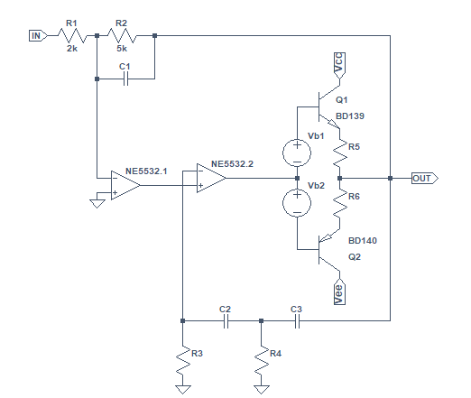

# Chapter 1

Like a story that begins with its ending, we will start this book with the ultimate answer. We will first look at the absolute pinnacle of contemporary audio engineering, the state-of-the-art and best-measuring circuits of the 2020s. If your only goal is to build the "Best Headphone Amplifier" right now, this chapter is all you need. After this, we will travel back in time to explore the older, classic designs that led us here.

Composite amplifiers have many aliases. Topping calls their composite architecture "NFCA" (Nested Feedback Composite Amplifier).

The idea of a composite amplifier is simple: combine two amplifiers so their open-loop gains multiply, enabling deeper feedback. As a result, distortion, bandwidth, noise, and output impedance can all improve. The main concern is oscillation. Each amplifier has its own dominant pole, and each pole adds 90 degrees phase lag. If the total phase lag approaches 180 degrees while loop gain is still above 0 dB, the circuit can oscillate. Therefore, poles and zeros must be configured carefully to keep a composite amplifier stable.

The simplest way to build a composite amplifier is to use a slow amp to drive a fast amp. This configuration is inherently stable because the slow amp's gain drops below 0dB before the fast amp introduces significant phase shift. 

To explain this non-technically, imagine the relationship between a driver (the first amp) and a vehicle (the second amp). If you pilot a massive vehicle that reacts seconds after you turn the wheel, steering a straight path becomes difficult. Constant over-correction and swerving are the mechanical equivalent of an amplifier oscillating. Conversely, if the vehicle responds faster than the driver's reflexes, the driver perceives little delay and does not over-correct. That behavior is analogous to a stable amplifier.

## Topping A90
The first amplifier introduced is the Topping A90 headphone amplifier. It uses an OPA1612 to drive two TPA6120A2. The topology is shown below:

In the A90, the second amplifier is configured at unity gain. It is therefore convenient to treat it as a low-distortion output stage that its gain and feedback only corrects its own local errors. The OPA1612 has about 40 MHz gain-bandwidth product (GBW). TI does not explicitly list GBW for TPA6120A2 in the same way, but we know it is basicly THS6012 which has about 300Mhz GBW. In practice, the first amp's loop gain is already very low at frequencies where the second amp contributes large phase lag, which helps preserve stability.

This is the simplest way to build a composite amplifier. A more detailed explanation can be found in "Composite Amplifiers: High Output Drive Capability with Precision" by Jino Loquinario from ADI {{#cite jino2019compositeampadi}}.

In real world, parasite capacitance of headphone and its wire may worse the amp stability, a zobel network is placed at the output. And C1\C2 together form a 1st order low-pass filter to better stable the amp.

The successor model, A90 Discrete, keeps the same core topology: a classic op-amp driving a current-feedback op-amp, but implemented with discrete components. I may add its schematic in a later version of this book.

## Omicron Headphone Amplifier
By placing the voltage gain of the second amplifier inside the global feedback loop, the composite amplifier leverages the combined open-loop gain (A1 x A2) for deep global feedback, rather than limiting the second amplifier to unity gain and treating it only as an output stage.

 Omicron headphone amplifier by Alexcp from diyaudio build in this way, here is the schematic diagram:

C2/C3 and R3/R4 form a two-pole compensate feedback network that helps recover phase margin.

## Turbocharged Audio Amplifier
Another example is an LM1875-based "Turbocharged audio amplifier" proposed by Kitchin et al. {{#cite kitchin1992turbocharged}}. It was designed for speakers, but it can also work with headphones. The composite design effectively improve the LM1875's noise floor.

R1, R2, and C1 form a phase-leading network, which creates a zero at $$ f_z = \frac{1}{2 \pi R_1 C_1} $$ and a higher-frequency pole at $$ f_p = \frac{1}{2 \pi (R_1 \parallel R_2) C_1} $$.

