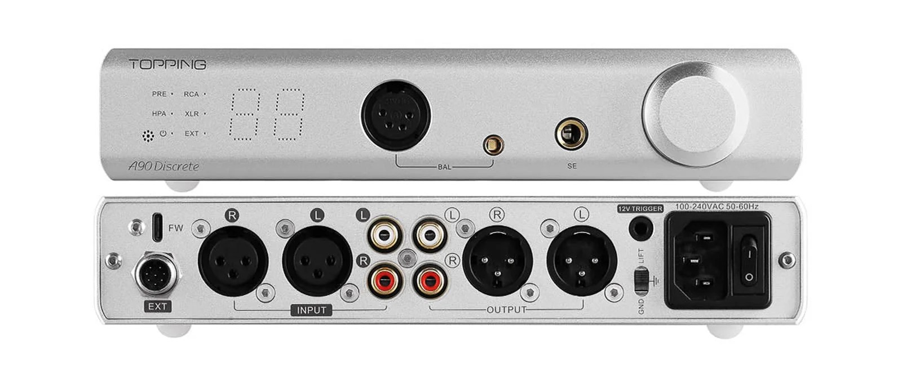
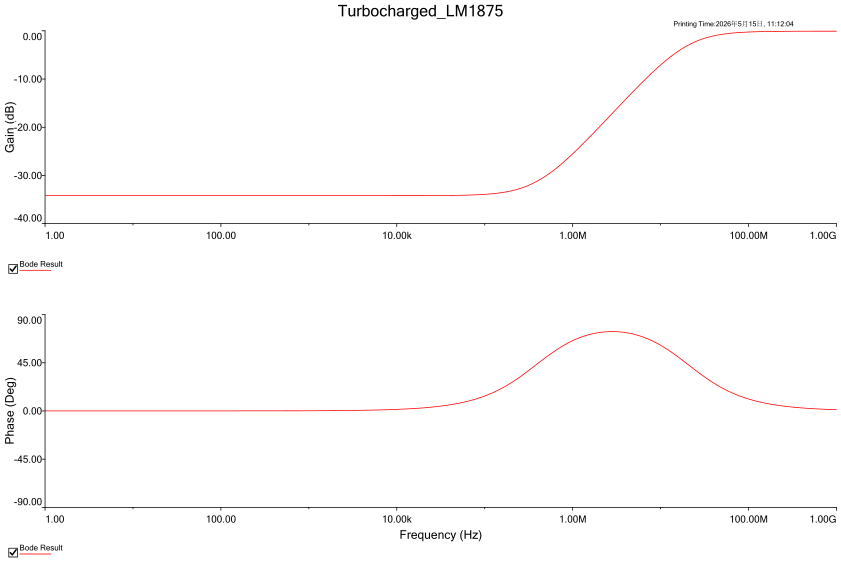
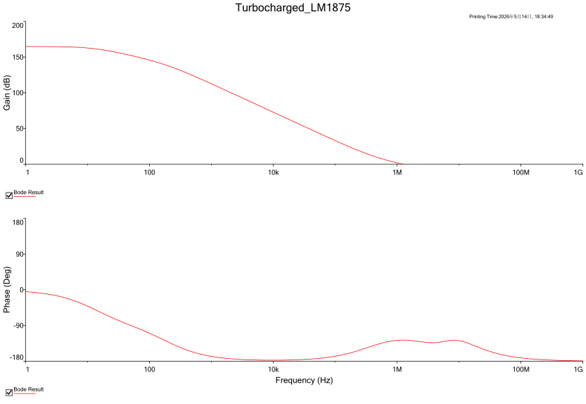
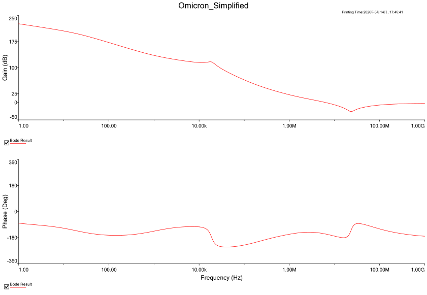

# Chapter 1

Like a story that begins with its ending, we will start this book with the ultimate answer. We will first look at the absolute pinnacle of contemporary audio engineering, the state-of-the-art and best-measuring circuits of the 2020s. If your only goal is to know the "Best Headphone Amplifier" right now, this chapter is all you need. After this, we will travel back in time to explore the older, classic designs that led us here.

Topping calls its design "NFCA" (Nested Feedback Composite Amplifier), but I'll use the audio community's more familiar name: the composite amplifier for the rest of this chapter.

The idea of a composite amplifier is simple: combine two amplifiers so their open-loop gains multiply, enabling deeper feedback. As a result, distortion, bandwidth, noise, and output impedance can all improve. The main concern is oscillation. Each amplifier has its own dominant pole, and each pole adds 90 degrees phase lag. If the total phase lag approaches 180 degrees while loop gain is still above 0 dB, the circuit can oscillate. Therefore, poles and zeros must be configured carefully to keep a composite amplifier stable.

## Topping A90

The simplest way to build a composite amplifier is to use a slow amp to drive a fast amp. This configuration is inherently stable because the slow amp's gain drops below 0 dB before the fast amp introduces significant phase shift. 

To explain this non-technically, imagine the relationship between a driver (the first amp) and a vehicle (the second amp). If you pilot a massive vehicle that reacts seconds after you turn the wheel, steering a straight path becomes difficult. Constant over-correction and swerving are the mechanical equivalent of an amplifier oscillating. Conversely, if the vehicle responds faster than the driver's reflexes, the driver perceives little delay and does not over-correct. That behavior is analogous to a stable amplifier.

A more detailed explanation can be found in "Composite Amplifiers: High Output Drive Capability with Precision" by Jino Loquinario from ADI {{#cite jino2019compositeampadi}}.

The Topping A90 was launched in 2020 at US$499. Although it was not the first Chinese headphone amplifier to achieve excellent measurements, it became a landmark product by combining extremely low noise and distortion with high output power at a relatively affordable price. Its fully balanced NFCA circuitry delivers up to 7.6 W into 16 ohms, with a specified dynamic range of 145 dB and THD below 0.00007%. Reviewers praised its transparent, neutral sound and ability to drive everything from sensitive IEMs to demanding planar headphones, although some found its presentation somewhat sterile or lacking soundstage depth.

The Topping A90 is the "slow-driver / fast-output" composite amplifier I described above: an OPA1612 drives two TPA6120A2. The OPA1612 has about 40 MHz gain-bandwidth product (GBW); though TI does not explicitly list GBW for TPA6120A2, I know it is basically THS6012 which has about 300MHz GBW.

Usually we do not factor the output stage's phase and gain variations into the amplifier's global stability analysis, treating it as if it were an ideal unity-gain buffer — one with infinite bandwidth that introduces no phase shift. This is, of course, not true. The output stage does generate phase shift, at a frequency set by the parasitic capacitance contributed by the headphone coil and its lead wires.

The second amplifier is a current-feedback amplifier, configured at unity gain and its gain and feedback only correct its own local errors. It is therefore convenient to treat it as an ordinary output stage. As long as its GBW is much larger than the first amplifier.

The topology is shown below.

The non-inverting amp drives the headphone's positive phase directly, and also feeds the inverting amp, whose output drives the negative phase. Some audiophiles may be bothered since such an architecture is pseudo-balanced. A zobel network is placed at the output. And C1 and C2 together form a 1st order low-pass filter to better stabilize the amp.

The successor model, A90 Discrete, keeps the same core topology: a voltage-feedback op-amp driving a current-feedback op-amp, both implemented in discrete components. I may add its schematic in a later version of this book.

## Turbocharged Audio Amplifier

In the Topping A90, the second amplifier is set at unity gain, so its local negative feedback mainly corrects its own distortion. If you want the second stage's gain to participate in global feedback, a classic example is the LM1875-based "Turbocharged Audio Amplifier" proposed by Kitchin et al. {{#cite kitchin1992turbocharged}}. It was designed as a power amplifier, but it can also work with headphones because the composite design effectively improves the LM1875's noise floor.

More open-loop gain allows deeper negative feedback, reducing the distortion of the amplifier from 0.02% (LM1875 alone) to 0.005% (AD711 + LM1875 composite).

A phase-lead network consisting of R1, R2, and C1 helps improve phase margin; otherwise, the amplifier will oscillate. As the transfer function shows, it creates a zero at \\(f_z = \frac{1}{2\pi R_1 C_1}\\), about 400 kHz, and a higher-frequency pole at \\(f_p = \frac{1}{2\pi (R_1 \parallel R_2) C_1}\\), about 20 MHz. This provides enough phase margin at the 0 dB gain crossover.

## Omicron Headphone Amplifier

In the "Turbocharged Audio Amplifier", about 30 dB of gain is sacrificed in the phase-leading network as the price of phase compensation. If you want more gain available for global feedback, the Omicron amplifier by Alexcp from diyaudio is built this way.

It is a sophisticated amplifier consisting of two gain stages and a Class A output stage.

From the Bode plot, we can see a peak in the gain curve at about 17 kHz, and the phase changes sharply around this frequency and drops below -180 degrees at higher frequencies, indicating a strong tendency toward oscillation. The phase recovers at about 1 MHz. Finally, some phase margin is preserved at the 0 dB gain crossover. Therefore, D3-D6 form a protection circuit that helps the amplifier recover from potential oscillation.

To be honest, I do not fully understand why this works; however, many members of the diyaudio community have built this amplifier, so there is no doubt that it works in practice.

If the complete schematic gives you a headache, here is a simplified version:

C1/C2 and R3/R4 form a two-pole compensating feedback network that helps recover phase margin; these are the main components of the frequency compensation network.
