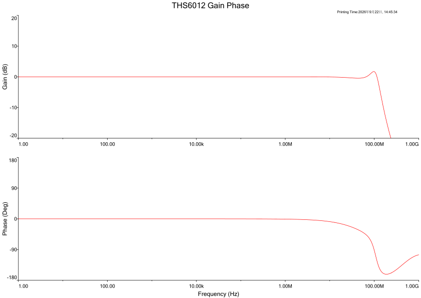
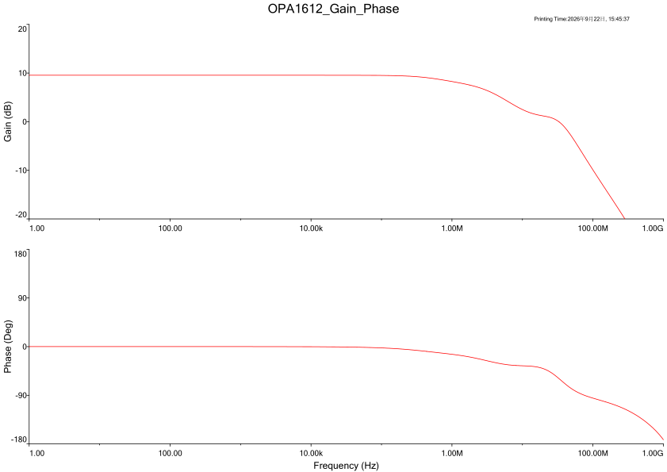
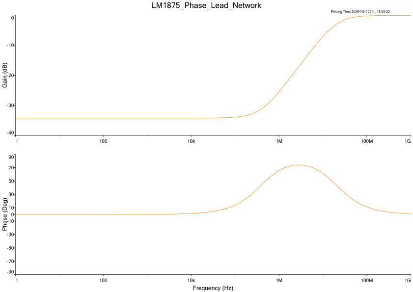
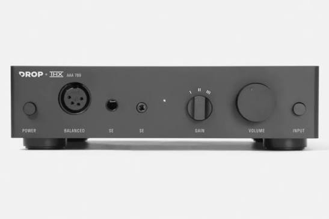
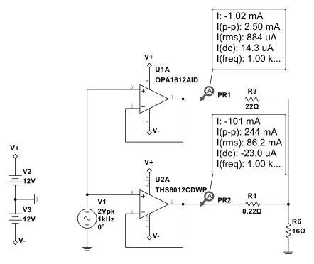
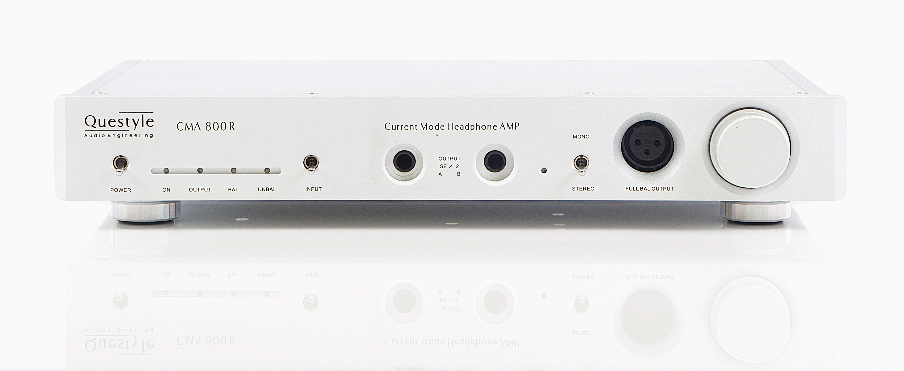

# Chapter 1

Like a story that begins with its ending, we will start this book with the ultimate answer. We will first look at the absolute pinnacle of contemporary audio engineering, the state-of-the-art and best-measuring circuits of the 2020s. If your only goal is to know the "Best Headphone Amplifier" right now, this chapter is all you need. After this, we will travel back in time to explore the older, classic designs that led us here.

Topping calls its design "NFCA" (Nested Feedback Composite Amplifier), SMSL calls it "PLFC" (Precision Linear Feedback Circuit), they are basically the same thing. I'll use the audio community's more familiar name: the composite amplifier for the rest of this chapter.

The idea of a composite amplifier is simple: cascade two amplifiers so their open-loop gains multiply, enabling deeper feedback. As a result, distortion, bandwidth, noise, and output impedance can all improve. 

The chanllege is to keep the feedback loop stable, because each amplifier has its own dominant pole, and each pole adds 90 degrees phase lag. If the total phase lag approaches 180 degrees while loop gain is still above 0 dB, the circuit can oscillate. Therefore, poles and zeros must be configured carefully to keep a composite amplifier stable.

## Topping A90

The Topping A90 was launched in May 2020 at US$499. It joined a measurement-driven wave of headphone amplifiers whose notable milestones included NwAvGuy’s Objective2 in 2011, the Massdrop THX AAA 789 and JDS Labs Atom in 2018, and the SMSL SP200 in 2019. These products made low noise, low distortion, and competitive pricing central to their appeal. The A90 became a landmark within this movement by combining exceptionally low noise and distortion with high output power and balanced connectivity at a relatively accessible price.

The topology is shown below.

The A90 combines an precision op-amp(OPA1612) drives two fast high-current op-amp(TPA6120A2) in parallel as output stage. 

The output stage set at unity voltage gain and can be treated as a fast buffer. TI specifies a typical small-signal bandwidth of 100 MHz for the THS6012 at unity gain, with a 1 kΩ feedback resistor, at 25 Ω load. If the global feedback loop crosses unity gain well below the output stage’s bandwidth, the output stage contributes relatively little additional phase lag at crossover, making the composite amplifier easier to stabilize.

OPA1612's GBW is 40Mhz, well below the 100Mhz bandwidth of the output stage, it should theoretically makes the amp stable. C67 and C70 provide additional high-frequency compensate, improve phase margin and make stability less sensitive to loading and parasitic effects. 

If we approximate the TPA6120A2 output stage as an ideal unity-gain wire, the circuit can be simplified as:

In this simplified circuit, \\(C_2\\) is in parallel with \\(R_3\\). This combination is in series with \\(C_1\\), and the whole branch is in parallel with \\(R_2\\). The feedback impedance is therefore

\\[
Z_f(s)=R_2\parallel
\left[
\frac{1}{sC_1}
+\left(R_3\parallel\frac{1}{sC_2}\right)
\right].
\\]

Here, \\(s=\sigma+j\omega\\) is the complex frequency variable used in the Laplace transform. For sinusoidal frequency-response analysis, set \\(\omega=2\pi f\\) , \\(j=\sqrt{-1}\\), and \\(\parallel\\) denotes impedances connected in parallel.

The simulated gain phase plot of OPA1612:

Let a slower drive stage controls a faster output stage, is one of the common approachs to make a compsite amplifier. The Topping A90 is this kind of composite amplifier. 

Imagine steering a boat that responds slowly. If you make another correction before the boat has reacted to the first, you can overcorrect and start zigzagging. Making corrections more slowly helps keep it on course. A boat that responds quickly is easier to steer. Similarly, an amplifier is easier to keep stable when its output stage responds much faster than the feedback loop tries to correct it.

A more detailed techinical explanation can be found in "Composite Amplifiers: High Output Drive Capability with Precision" by Jino Loquinario from ADI {{#cite jino2019compositeampadi}}.
<!-- 
Some audiophiles may be bothered since it is pseudo-balanced, the inverting output is generated from non-inverting output, Bryston BHA-1 and many other Hi-Fi amplifiers have implemented such topology too.
-->
The successor model, A90 Discrete, keeps the same core topology: a voltage-feedback op-amp driving a fast current-feedback op-amp, both implemented in discrete components.

## Turbocharged Audio Amplifier

In the Topping A90, the second amplifier is set at unity gain, so its local negative feedback mainly corrects its own distortion. If you want the second stage's gain to participate in global feedback, a classic example is the LM1875-based "Turbocharged Audio Amplifier" proposed by Kitchin et al. {{#cite kitchin1992turbocharged}}. It was designed as a power amplifier, but it can also work with headphones because the composite design effectively improves the LM1875's noise floor.

More open-loop gain allows deeper negative feedback, reducing the distortion of the amplifier from 0.02% (LM1875 alone) to 0.005% (AD711 + LM1875 composite).

A phase-lead network is another approach to build a composite amplifier. 

In this exmample, R1, R2, and C1 form a phase-lead network, it helps improve phase margin, otherwise the amplifier will oscillate. As the transfer curve shows, it creates a zero at \\(f_z = \frac{1}{2\pi R_1 C_1}\\), about 400 kHz, and a higher-frequency pole at \\(f_p = \frac{1}{2\pi (R_1 \parallel R_2) C_1}\\), about 20 MHz. This provides enough phase margin at the 0 dB gain crossover. Finally the close-loop gain and phase shown as below:

## Omicron Headphone Amplifier

In the "Turbocharged Audio Amplifier", about 30 dB of gain is sacrificed in the phase-leading network as the price of phase compensation. If you want more gain available for global feedback, the Omicron amplifier by Alexcp from diyaudio is built this way. It implements a dual-pole compensate.

It is a sophisticated amplifier consisting of two gain stages and a Class A output stage.

From the Bode plot, we can see a peak in the gain curve at about 17 kHz, and the phase changes sharply around this frequency and drops below -180 degrees at higher frequencies, indicating a strong tendency toward oscillation. The phase recovers at about 1 MHz. Finally, some phase margin is preserved at the 0 dB gain crossover. Therefore, D3-D6 form a protection circuit that helps the amplifier recover from potential oscillation.

To be honest, I do not fully understand why this works; however, many members of the diyaudio community have built this amplifier, so there is no doubt that it works in practice.

If the complete schematic gives you a headache, here is a simplified version:

C1/C2 and R3/R4 form a two-pole compensating feedback network that helps recover phase margin; these are the main components of the frequency compensation network.

## THX AAA 789

The Massdrop × THX AAA 789 was launched in 2018 at US$349.99. Developed jointly by Massdrop and THX and sold through Massdrop, it became a landmark by combining high output power with exceptionally low distortion at an accessible price. THX specified up to 6 W per channel into 32 ohms through its bridged output, and THD as low as 0.00001% at 100 mW into 300 ohms. It provided a prominent showcase for THX’s Achromatic Audio Amplifier technology, which uses feed-forward error correction to reduce distortion. The same technology family also appeared in Benchmark’s HPA4, SMSL’s SP200 and SP400, and products from FiiO.

Feed-forward error correction technology has a long history to tell. Harold S. Black, working at Bell Telephone Laboratories in the late 1920s, developed both negative-feedback and feed-forward error-correction concepts. In a feed-forward system, the error produced by a main amplifier is extracted, amplified separately, and then injected into the output with opposite polarity so that the distortion is cancelled rather than reduced. 

QUAD adapted this principle to audio power amplification in the 1970s. Peter Walker and Michael Albinson introduced the term current dumping for an architecture in which a small, highly linear amplifier controls the output voltage while a much more powerful Class-B output stage supplies most of the load current. This approach became the basis of the QUAD 405 amplifier. 

The later THX low-dissipation amplifier patent applies a related feed-forward error-correction concept to a topology that avoids the balancing inductor used in the QUAD approach. The Schematic of THX AAA 789 is shown as below:

The original design use OPA1602 and OPA564, but I don't have model of OPA1602, so I use the combination of Topping A90, which makes these two topology comparable. It is complecated desing, to understand this, we have to start from beginning.

If we paralleing a precision op-amp as error-correction amp and a high-current op-amp as power amp, with different output resistor, certainly the output current will allocated by the raio of R1/R3, in our case it is 1/100.

If the power amp contribute some error/distorion, the error-correction amp can help fix it, but it needs a way to sense that error. We need to understand wheatstone bridge first. In a wheatstone bridge, whatever voltage signal applied, the voltage of Point A and B will be identical.

That is how we pick up feedback signal. Point A is the output voltage to load and Point B is the voltage feedback to the error-correction amp. 

## Questyle CMA800R

Questyle's original CMA800, and the later CMA800R shown here, brought another high-speed composite approach to headphone amplifiers in the early 2010s. The name stands for **Current Mode Amplifier** (电流模放大器){{#cite wang2017currentanalogamp}}. Questyle specified THD+N of 0.00038% at 1 kHz into 300 ohms, that was excellent figures of its period.

It is a opamp+buffer design, but the output transistor is not driven by the output of opamp as usual. The output stage is a VCCS(voltage control current source), so voltage gain depends on the load, for load larger than 250 ohms, it adds some gain, so I still classify it as composite amplifier.  

To better illustrate its operation, I remove the R8 protection resistor, Add voltage/current probe A, B, C, D.

Let the small-signal voltage at the op-amp booster, point A, be \\(V_A\\). Resistor \\(R_9=1.5\ \mathrm{k\Omega}\\) converts this voltage into an op-amp output current \\(I_A\approx\frac{V_A}{R_9}\\).

During the positive half-cycle, this current is drawn through the positive supply pin, \\(Q_2\\), and \\(R_2\\). The \\(Q_4\\)–\\(R_{13}\\) path operates vice versa in the negative half-cycle. 

\\(R_2\\) act as a current-sensing resistor, it converts changes in the op-amp’s supply current into a control voltage at point B. The signal voltage across \\(R_2\\) is approximately 

\\[
V_B\approx {I_A} {R_2}
\approx{V_A}\frac{R_2}{R_9}
\\]

The complementary compound pair \\(Q_1\\)-\\(Q_3\\) makes the signal voltage across emitter resistor \\(R_4\\) approximately equal to the voltage across \\(R_2\\). Therefore \\(I_C\approx\frac{V_B}{R_4}\approx I_A\frac{R_2}{R_4}\\).

Substituting \\(R_2=500\ \Omega\\) and \\(R_4=15\ \Omega\\), the approximate current gain of one half of the output stage is

\\[
\frac{I_C}{I_A}\approx\frac{500}{15}\approx33.3.
\\]

Combining this result with \\(I_A\approx V_A/R_9\\) and \\(I_C\approx I_D\\), gives the booster's effective transconductance:

\\[
g_{m,\mathrm{boost}}
=\frac{I_D}{V_A}
\approx\frac{R_2}{R_9R_4}
=\frac{500}{1500\times15}
\approx22.2\ \mathrm{mS}.
\\]

The booster's standalone small-signal voltage transfer is not fixed; it depends on the headphone impedance. It is unity gain when load is about 45\\(\Omega\\):

\\[
A_{v,\mathrm{boost}}
\approx g_{m,\mathrm{boost}}R_L
\approx\frac{R_L}{45\ \Omega}.
\\]

For example,

\\[
A_{v,\mathrm{boost}}\approx0.71\quad(R_L=32\ \Omega)
\\]

\\[
A_{v,\mathrm{boost}}\approx6.67\quad(R_L=300\ \Omega).
\\]

These figures describe only the simplified current-booster path. In the complete amplifier, global negative feedback determines the final voltage gain. From \\(R_{10}=2.2\ \mathrm{k\Omega}\\) and \\(R_7=510\ \Omega\\), gives

\\[
A_{v,\mathrm{CL}}
\approx1+\frac{R_{10}}{R_7}
=1+\frac{2200}{510}
\approx5.31,
\\]

or

\\[
20\log_{10}(5.31)\approx14.5\ \mathrm{dB}.
\\]

Questyle's manual lists a nominal gain of 15.5 dB.