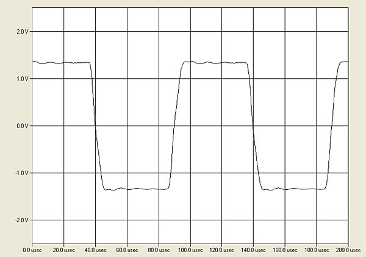
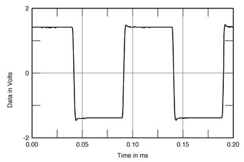
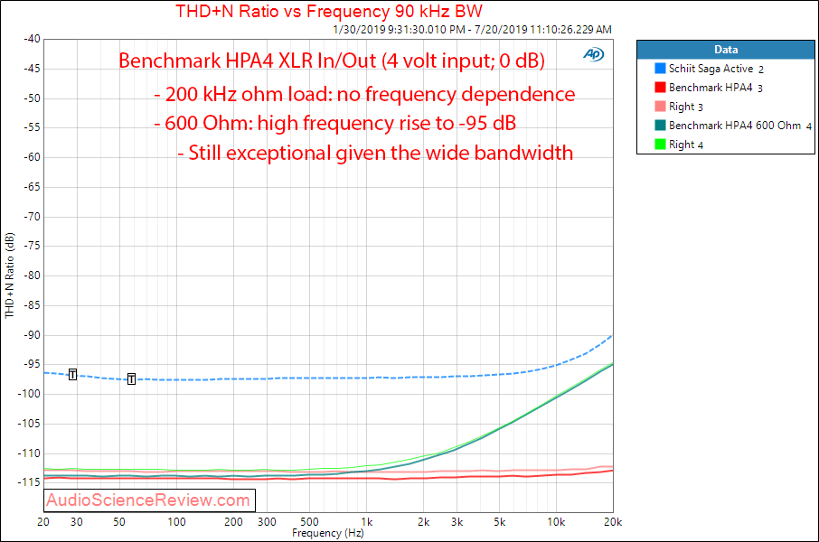

# Chapter 5

Negative feedback improves nearly every aspect of an amplifier: it lowers output impedance, increases damping factor and PSRR, flattens the frequency response, and most well-known, reduces distortion. 

This can motivate designers to pursue higher open-loop gain for deeper global feedback, especially because this can produce excellent distortion measurements at 1 kHz. However, low distortion does not guarantee good sound. adequate phase margin must also be considered.

Feedback theory requires positive phase and gain margins for stability, but merely positive margins may produce severe ringing. A Hi-Fi audio amplifier should generally have at least about 45° of phase margin—preferably around 60°.

A small-signal square-wave test is useful for examining an amplifier’s transient response and revealing possible stability problems. A square wave contains a fundamental and a series of odd harmonics extending to high frequencies. If the amplifier has inadequate phase margin or an underdamped high-frequency response, its output may exhibit overshoot or ringing at each transition. Graham Slee has associated this type of ringing with an “icy-bright” sound {{#cite slee2011bandwidth}}. Related discussions of feedback stability, transient distortion, and sonic character can be found in Crowhurst {{#cite crowhurst1957amplifiers}}, Otala {{#cite otala1970transient}}, Cherry {{#cite cherry1982feedback}}, Koren {{#cite koren1997spice}}, and Putzeys {{#cite putzeys2010fword}}.

Two published measurements illustrate these effects. In *Stereophile*'s measurement of the Woo Audio WA5, the 10 kHz square-wave response shows small, quickly damped ringing after each transition.

*Woo Audio WA5, small-signal 10 kHz square wave into 8 ohms. Source: [Stereophile measurements](https://www.stereophile.com/content/woo-audio-wa5-integrated-amplifierheadphone-amplifier-measurements).*

The HeadRoom BlockHead headphone amplifier provides another example. Its ultrasonic response peaks slightly above 200 kHz, and the corresponding 10 kHz square-wave response shows overshoot at the leading edges.

*HeadRoom BlockHead, high gain, small-signal 10 kHz square wave into 600 ohms. Source: [Stereophile measurements](https://www.stereophile.com/content/headroom-blockhead-headphone-amplifier-measurements).*

In a conventional dominant-pole-compensated amplifier, raising the open-loop gain requires moving the dominant pole downward to preserve stability. The dominant pole contributes 90 degrees of phase lag, a second pole contributes another 45 degrees at its corner frequency. To retain a phase margin of at least 45 degrees, the open-loop gain should cross unity before the second pole.

Consider an amplifier with 120 dB of open-loop gain and its dominant pole at 10 Hz. Above that pole, its gain falls at 20 dB per decade, reaching unity-gain at 10 MHz. The second pole must therefore be near or above 10 MHz to guarantee unity-gain stable. This is demanding, although possible with high-speed devices.

Such an amplifier may measure low distortion at 1 kHz. By 10 kHz, however, its open-loop gain has fallen by 60 dB, leaving only 60 dB of gain for feedback. As loop gain continues to fall, the closed-loop distortion normally rises.

The graph below is a measurement of Benchmark HPA4. The load dependence distortion shows that more residual error at high frequency under heavier loading, I guess the distorion generated by output stage are not efficiently corrected by negative feedback at higher frequency.

*Benchmark HPA4 XLR preamplifier input/output path at 4 V and 0 dB gain, THD+N versus frequency with a 90 kHz measurement bandwidth. The nearly coincident dark-green and green traces are the two channels driving 600 Ω. Sources: [Audio Science Review](https://www.audiosciencereview.com/forum/index.php?threads/review-and-measurements-of-benchmark-hpa4-headphone-amp-pre.8141/).*

Some designers consider rising distortion at higher frequencies a potential problem, an alternative approach is to lower open-loop gain, move the dominant pole upward, preserving useful open-loop gain through more of the audio band. Instead of very high gain followed by an early roll-off.

Graham Slee markets a related bandwidth-extension approach as *Ultra-Linear*, while Douglas Self discusses this design goal under “Manipulating Open-Loop Bandwidth” in the chapter “The Voltage-Amplifier Stage” of *Audio Power Amplifier Design Handbook*. McIntosh uses another method, which will be examined later in this chapter.

This chapter begins with simple schematics and progresses to more complex designs, explaining the techniques each one uses.

## Rudistor RP030

The RudiStor RP030 was launched around 2011 at approximately US$5,000. Designed as RudiStor’s flagship solid-state headphone amplifier, it uses a fully balanced quad-mono architecture and provides both balanced and single-ended inputs and outputs. Owners commonly describe its sound as spacious, refined, slightly warm, and especially attractive with high-impedance dynamic headphones such as the Sennheiser HD800. Some listeners, however, find it less forceful with demanding planar-magnetic headphones, while its very high price and inconsistent build quality attracted criticism.

It uses a differential input/amplification stage with a single-ended class A output stage. It is inherently a balanced amplifier, but can operate in single-ended mode by leaving one arm of the input or output stage unused.

When opearted in fully balanced, carefully matched JFETs input stage can cancels second-order distortion at the balanced output. The distortion spectrum from simulation is shown below:

When operated in single-ended, this cancellation is ineffective, and second-order distortion is present.

Its gain and phase plot is as follows:

The RP030 uses no global negative feedback, so there is no concern for phase margin, and its frequency response is flat up to about 800 kHz. It has 20 dB gain, which is high for modern headphones, so R4 and R7 are placed after the potentiometer to further reduce the input signal level. The negative rail power is underutilized, as the output is constrained from swinging below 0 V.

## NAIM Headline Headphone Amplifier (NAHA)

The Naim HeadLine was launched in 1998 at a launch-era price of approximately £400 for a usable system—£215 for the amplifier and £185 for the required NAPSC power supply. This compact British headphone amplifier follows Naim’s modular philosophy: it has no internal power supply and can instead be powered by a NAPSC, FlatCap, HiCap, or SuperCap. Naim promoted the HeadLine as a low-noise, low-distortion amplifier for high-quality headphones, while owners commonly praise its rhythmic, dynamic, and coherent presentation.

The NAHA uses a classic three-stage amplifier architecture. Q7 is the voltage-amplification stage (VAS), increasing the open-loop gain from about 17 dB to 84 dB. This is a gain of 67 dB; using 66 dB for a simple approximation, in which 20 dB is $\times 10$, 60 dB is $\times 10^3$, and 6 dB is $\times 2$, altogether 66 dB gives about $A_v \approx 2000$ gain.

Through the Miller effect, C4 therefore appears at the base of Q7 as approximately:

$$ C_M \approx C_4(1 + A_v) \approx 39\text{ pF} \times 2001 \approx 78\text{ nF} $$

R12 is part of the resistance that determines the pole, but it is in parallel with the small-signal impedances of Q7 and Q8. An effective resistance of about 580 Ω, consistent with the simulated response, gives:

$$ f_p \approx \frac{1}{2\pi R_{\text{eff}}C_M} \approx \frac{1}{2\pi(580\ \Omega)(78\text{ nF})} \approx 3.5\text{ kHz} $$

The simulation shows a phase margin of about 65° and a gain margin of about 10 dB.

## Goldmund Telos Headphone Amplifier

The Goldmund Telos Headphone Amplifier—also called the Telos HDA or THA—was launched in 2014 at approximately US$10,000, or ¥1.65 million in Japan. This substantial Swiss-made amplifier combines Goldmund’s wide-bandwidth Telos amplification circuitry with a built-in DAC and two headphone outputs. Reviewers praised its precise construction and clean, detailed, weighty sound, although some users reported audible background noise with sensitive headphones and questioned whether its performance justified the exceptionally high price. It was succeeded in 2015 by the Telos Headphone Amplifier 2, or THA2, priced at £9,250 in the UK.

Look at the inside:

Have you noticed the "WOOFER" and "TWEETER" labels on the PCB? This is a PCB design for Goldmund active speakers, and they use the same PCB from their entry-level amplifier, the Telos 7, to their mainstream product, the Telos 590, and even to their high-end products, the Telos 600/1000/5000. It's the technology Goldmund acquired from Job Electronics.

Reviewers’ reports of audible background noise are not surprising: the amplifier module was originally designed for loudspeakers, its noise performance not have been optimized for sensitive headphones. I was surprised by how leniently the reviewer treated this flaw in such an expensive product:

> 在講THA 2的聲音表現之前，要提一件THA 2讓我感到困惑的地方，就是耳機一插上去就可以感受到些許電氣底噪，照理說，以THA 2的等級，應該背景安安靜靜，幾乎感受不到電氣底噪才對，但是我不管換上Pioneer SE-Master1、Sony MDR-1R MKII或Audeze EL-8，都感受得到THA 2的底噪，只有搭Sennhessier HD800S或HIFIMAN HE1000，THA 2的底噪才不那麼明顯。這耳機才剛接上，還沒聽音樂就皺了眉頭，可是等我放了音樂，那電氣底噪就消失無蹤了，本來我以為電氣底噪會影響聽感，實際上卻一點也不影響，但是在THA 2這個等級的耳擴上面，可以聽到這些許底噪，倒是讓我相當意外。
>
> — [U-Audio 評論](https://review.u-audio.com.tw/reviewdetail.asp?reviewid=1111)

The schematic is shown below. Notice that output protection is omitted and that the output stage uses two parallel transistor pairs.

The circuit employs a high-bandwidth architecture for fast transient response, but this comes at the cost of limited phase margin and open-loop gain about 95 dB (from simulation), it is not unity-gain stable, the minimum stable gain > 4 and it suffers from compromised power supply rejection ratio (PSRR).

## McIntosh MHA-150 Headphone Amplifier

The McIntosh MHA150 was launched in 2016 at US$4,500. Although marketed primarily as a headphone amplifier, it is actually a compact all-in-one system combining a high-resolution DAC, a dedicated headphone amplifier, a preamplifier, and a 50-watt-per-channel speaker amplifier. McIntosh’s output Autoformers provide three selectable headphone-impedance ranges, while its speaker outputs can drive efficient desktop or bookshelf speakers. Reviewers praised its powerful, open and refined headphone performance, capable DAC, and versatility, although its limited analogue inputs and modest speaker power make it better suited to a desktop or small-room system than to demanding floorstanding speakers.

The schematic is similar to the entry-level McIntosh MA6300 Integrated Amplifier, But one fewer pair of output transistor, and 50W less output power. It uses a complementary differential input pairs followed by a push-pull voltage-amplification stage.

For clarity, the lower half has been omitted, giving a simplified circuit below:

At first glance, the circuit may appear to be a traditional three-stage amplifier. However, it is not: Q2 and U3 form a folded-cascode circuit, not a voltage-amplification stage (VAS). Unlike most of the folded-cascode circuit I have ever seen that folds both arm of the input differential pair, MHA-150 feed the voltage gain of another arm to the base of Q2 by Q3 in a emit follower setup. Very interesting design, especially look compares it with the The Kuroda Discrete op-amp.

## The Kuroda Discrete OP-AMP

This is Discrete op-amp design introduced in Chapter 4 of his book "解析 OPアンプ&トランジスタ活用" {{#cite kuroda2015opamp}} , but this book is never translated into English. Nevertheless, the circuit is an elegant design, with greater output-current capability, could be adapted for use as a headphone amplifier.
