# Chapter 5

Discrete amplifiers can be complicated, so I will start from a simple schematic.

## Rudistor RP030

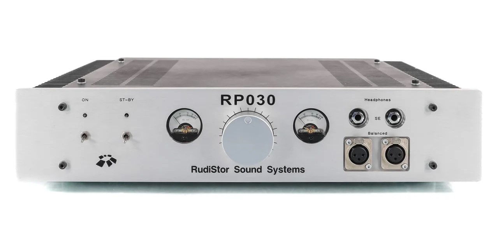

The RudiStor RP030 was launched around 2011 at an approximately US$5,000 price point. Designed as RudiStor’s flagship solid-state headphone amplifier, it uses a fully balanced quad-mono architecture and provides both balanced and single-ended inputs and outputs. Owners commonly describe its sound as spacious, refined, slightly warm, and especially attractive with high-impedance dynamic headphones such as the Sennheiser HD800. Some listeners, however, find it less forceful with demanding planar-magnetic headphones, while its very high price and inconsistent build quality attracted criticism.

It uses a differential input/amplification stage with a single-ended class A output stage. It is inherently a balanced amplifier, but can operate in single-ended mode by leaving one arm of the input or output stage unused.

When used in full balanced mode, if the two JFETs in the input stage are carefully paired, second-order distortion is canceled. The distortion spectrum from simulation is shown below:

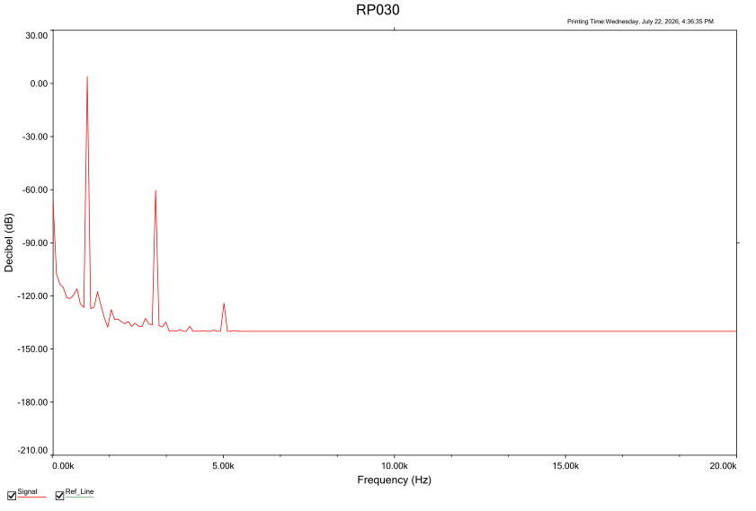

When operating in single-ended mode, the cancellation is ineffective, and second-order distortion is present.

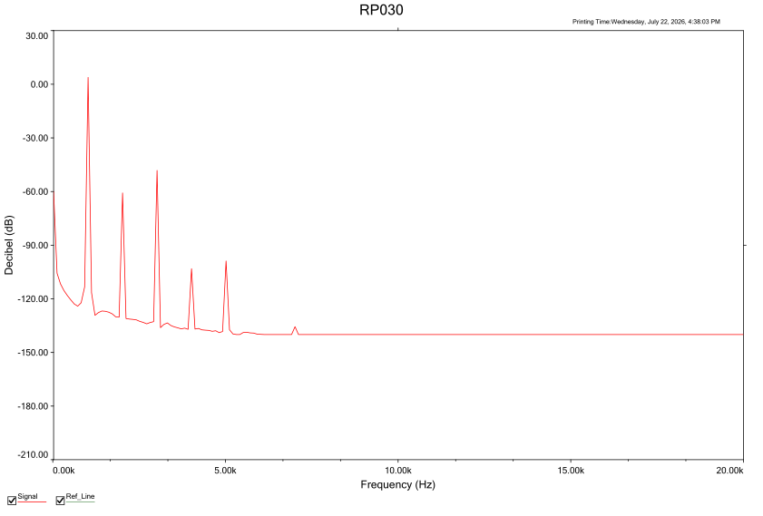

Its gain and phase plot is as follows:

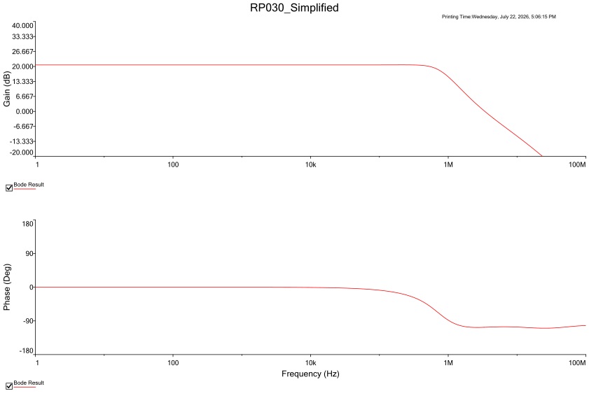

The RP030 uses no global negative feedback, so there is no concern for phase margin, and its frequency response is flat up to about 800KHz. It has 20dB gain, which is high for a headphone amplifier; R4 and R7 are variable resistors after the potentiometer to further reduce the input signal level. The negative rail power is underutilized, as the output is constrained from swinging below 0V.

## NAIM Headline Headphone Amplifier (NAHA)

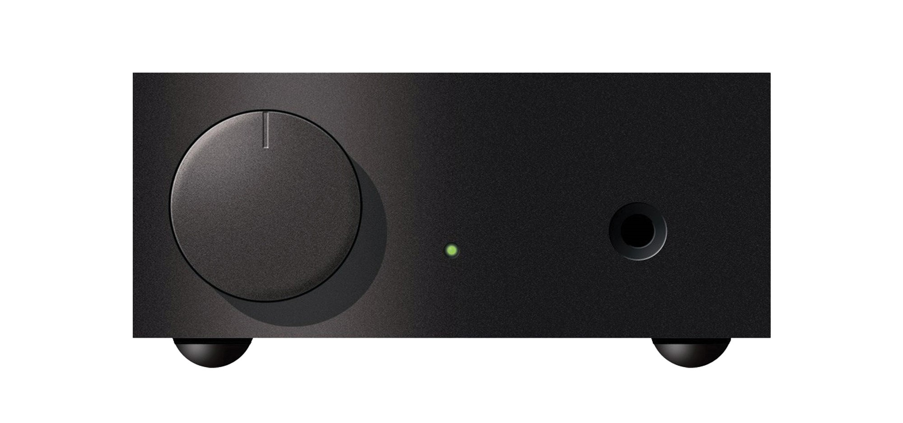

The Naim HeadLine was launched in 1998 at a launch-era price of approximately £400 for a usable system—£215 for the amplifier and £185 for the required NAPSC power supply. This compact British headphone amplifier follows Naim’s modular philosophy: it has no internal power supply and can instead be powered by a NAPSC, FlatCap, HiCap, or SuperCap. Naim promoted the HeadLine as a low-noise, low-distortion amplifier for high-quality headphones, while owners commonly praise its rhythmic, dynamic, and coherent presentation.

The NAHA uses a classic three-stage amplifier architecture. Q7 is the voltage-amplification stage (VAS), increasing the open-loop gain from about 17 dB to 84 dB. This is a gain of 67 dB; using 66 dB for a simple approximation gives:

$$ A_v \approx 10^{66/20} \approx 2000 $$

Through the Miller effect, C4 therefore appears at the base of Q7 as approximately:

$$ C_M \approx C_4(1 + A_v) \approx 39\text{ pF} \times 2001 \approx 78\text{ nF} $$

R12 is part of the resistance that determines the pole, but it is in parallel with the small-signal impedances of Q7 and Q8. An effective resistance of about 580 Ω, consistent with the simulated response, gives:

$$ f_p \approx \frac{1}{2\pi R_{\text{eff}}C_M} \approx \frac{1}{2\pi(580\ \Omega)(78\text{ nF})} \approx 3.5\text{ kHz} $$

The simulation shows a phase margin of about 65° and a gain margin of about 10 dB.

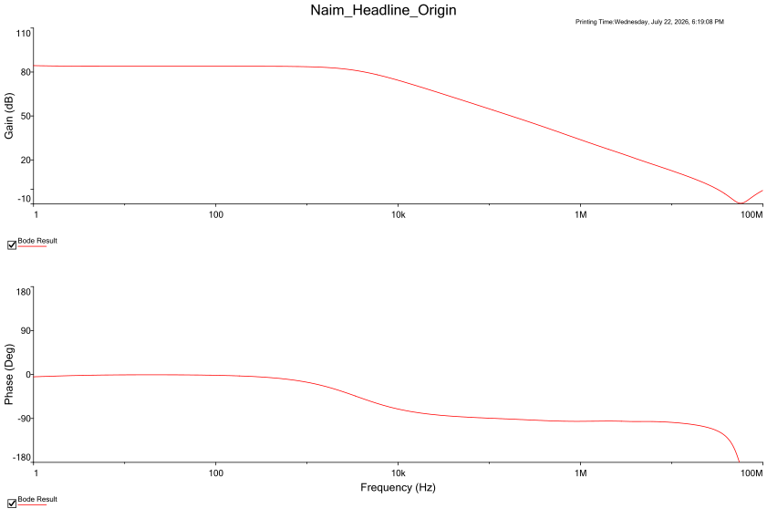

## Goldmund Telos Headphone Amplifier

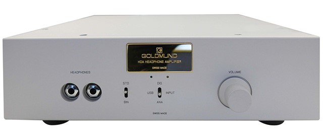

The Goldmund Telos Headphone Amplifier—also called the Telos HDA or THA—was launched in 2014 at approximately US$10,000, or ¥1.65 million in Japan. This substantial Swiss-made amplifier combines Goldmund’s wide-bandwidth Telos amplification circuitry with a built-in DAC and two headphone outputs. Reviewers praised its precise construction and clean, detailed, weighty sound, although some users reported audible background noise with sensitive headphones and questioned whether its performance justified the exceptionally high price. It was succeeded in 2015 by the Telos Headphone Amplifier 2, or THA2, priced at £9,250 in the UK.

Look at the inside:

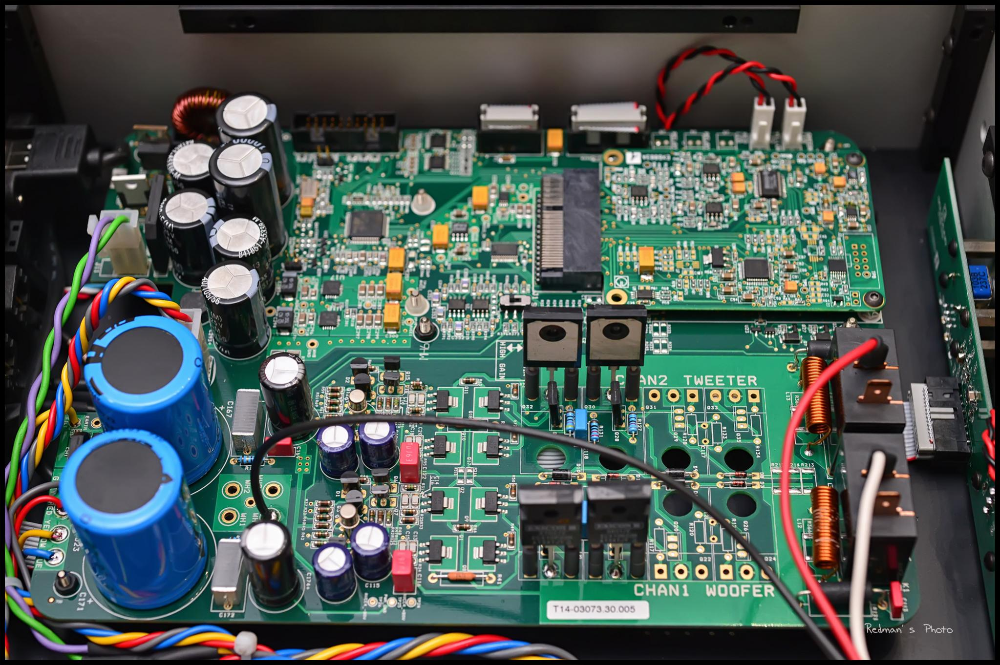

Have you noticed the "WOOFER" and "TWEETER" labels on the PCB? This is a PCB design for Goldmund active speakers, and they use the same PCB from their entry-level amplifier, the Telos 7, to their mainstream product, the Telos 590, and even to their high-end products, the Telos 600/1000/5000. It's the technology Goldmund acquired from Job Electronics. This PCB is now installed in their headphone amplifiers.

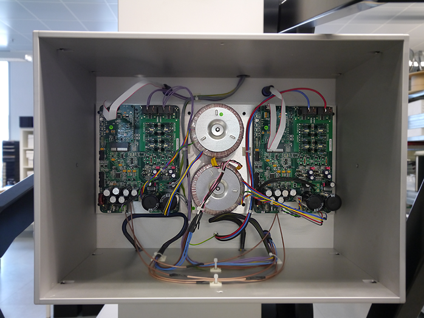

No wonder reviews said they have audible noise, this is originally designed for speakers, if you just plug in headphones, of course you will hear noise. I laughed when I read this - people are way too lenient with this brand:

> 在講THA 2的聲音表現之前，要提一件THA 2讓我感到困惑的地方，就是耳機一插上去就可以感受到些許電氣底噪，照理說，以THA 2的等級，應該背景安安靜靜，幾乎感受不到電氣底噪才對，但是我不管換上Pioneer SE-Master1、Sony MDR-1R MKII或Audeze EL-8，都感受得到THA 2的底噪，只有搭Sennhessier HD800S或HIFIMAN HE1000，THA 2的底噪才不那麼明顯。這耳機才剛接上，還沒聽音樂就皺了眉頭，可是等我放了音樂，那電氣底噪就消失無蹤了，本來我以為電氣底噪會影響聽感，實際上卻一點也不影響，但是在THA 2這個等級的耳擴上面，可以聽到這些許底噪，倒是讓我相當意外。
>
> — [U-Audio 評論](https://review.u-audio.com.tw/reviewdetail.asp?reviewid=1111)

Here is the schematic, notice output protection is omitted, and output stage is dual parallel:

The circuit employs a high-bandwidth architecture for fast transient response, but this comes at the cost of limited phase margin; additionally, its relatively low open-loop gain results in compromised power supply rejection ratio (PSR).

## McIntosh MHA-150 Headphone Amplifier

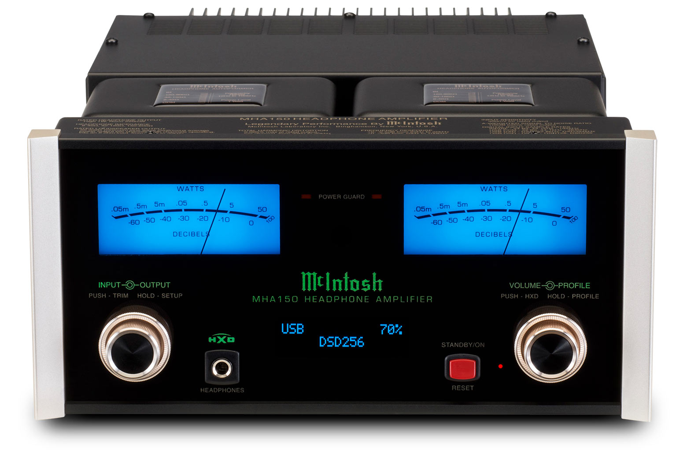

The McIntosh MHA150 was launched in 2016 at US$4,500. Although marketed primarily as a headphone amplifier, it is actually a compact all-in-one system combining a high-resolution DAC, a dedicated headphone amplifier, a preamplifier, and a 50-watt-per-channel speaker amplifier. McIntosh’s output Autoformers provide three selectable headphone-impedance ranges, while its speaker outputs can drive efficient desktop or bookshelf speakers. Reviewers praised its powerful, open and refined headphone performance, capable DAC, and versatility, although its limited analogue inputs and modest speaker power make it better suited to a desktop or small-room system than to demanding floorstanding speakers.

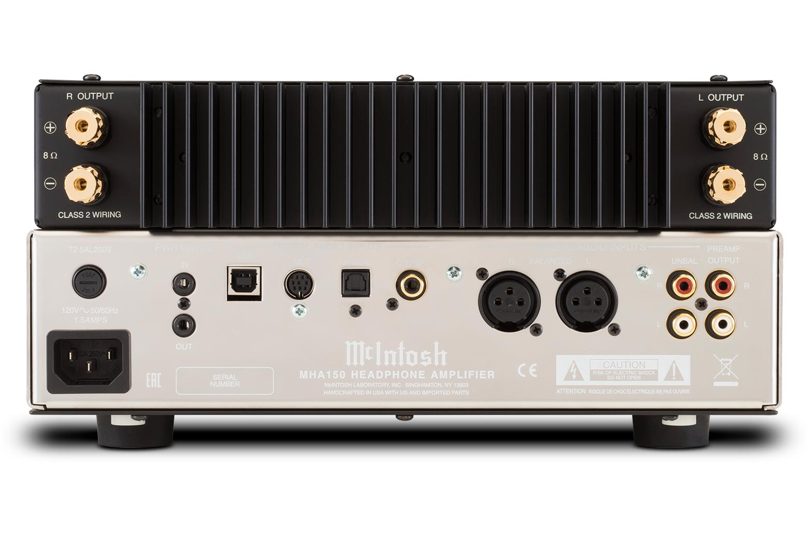
