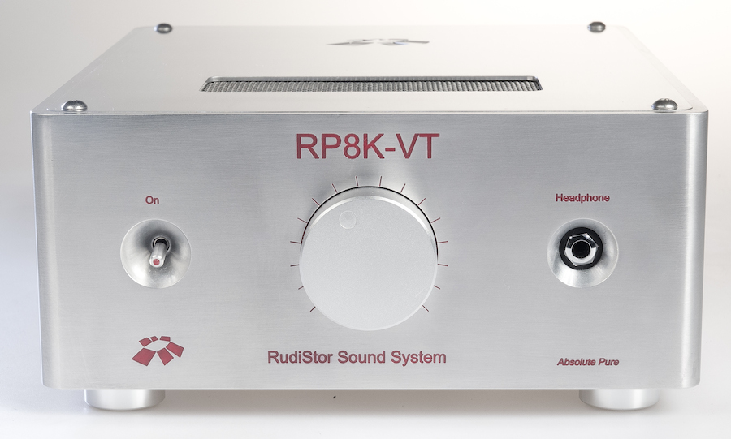
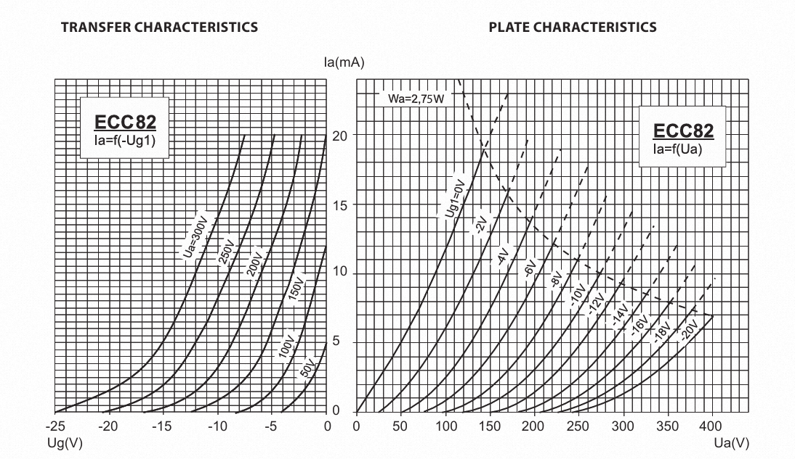
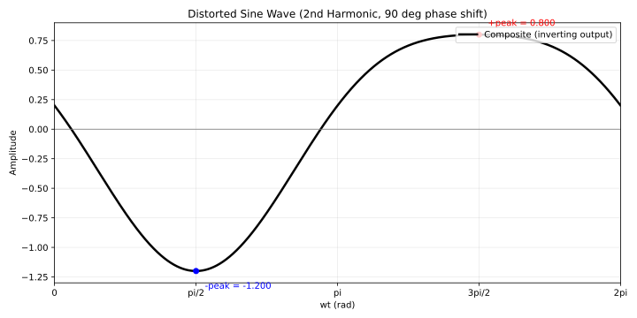
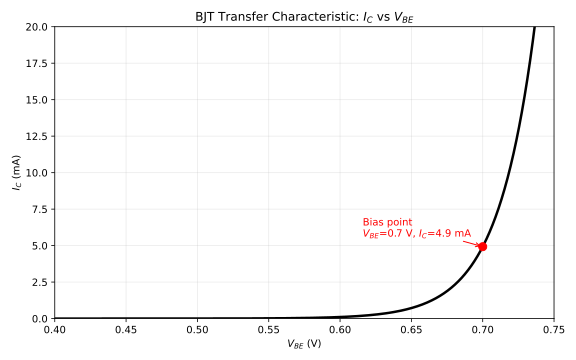
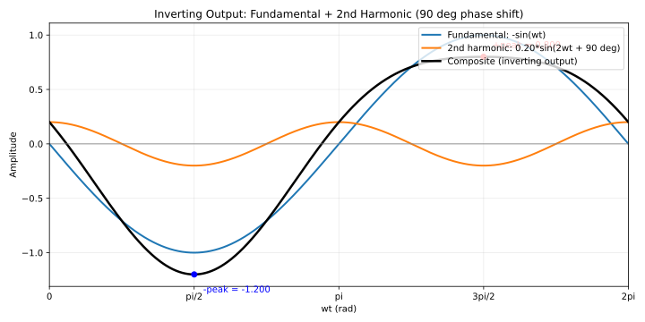
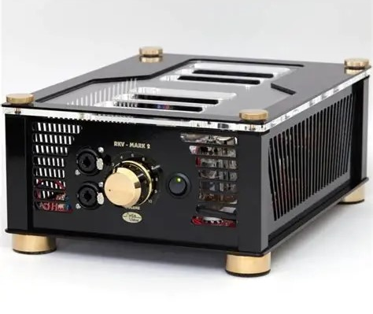

# Chapter 4

Hybrid amplifiers can be classified by device arrangement across stages, such as tube-gain/solid-state-power and solid-state-gain/tube-power designs. In practice, they usually sound either tube-like or solid-state-like, rather than a blend of both.

## Rudistor RP7

The Rudistor RP7 is a boutique hybrid headphone amplifier by Italian designer Rudi Stor. Community discussions often describe the RP7 having a warm-leaning presentation and strong pairing with classic high-impedance headphones such as the HD600, HD650, K501, and K601. Some users have complained about build quality and high pricing. Sadly, after the COVID-19 pandemic around 2020, Mr. Rudi lost contact with the Hi-Fi community.

The follow-up models RP8, RP9 have almost the same schematic with merely some component changes.

The schematic, like the SinglePower amplifiers introduced in the previous chapter, is a textbook-simple circuit, single-end gain-stage and single-end output-stage, but there are also tricks in it. You may notice that R7 is an adjsustable resistor, what is it adjusted for?

First, it uses load-line distortion cancellation as I mentioned before, Nelson Pass wrote a brilliant article about it {{#cite pass2009thesweetspot}}, in short, the bending of the transfer and plate characteristics tends to cancel out.

Then, it implemented a Gain-stage Output-stage distortion cancellation technique. Note the in transfer characteristic above, the line is not straight, which means the transconductance(gm) of the tube is not constant, it becomes higher when input signal is positive, and lower when input negative. The nonlinearity makes one half of the waveform sharper and the other half blunter — one side peaks higher and narrower, the other peaks lower and wider:

The BJT in the output stage has a similarly nonlinear transfer curve. Although the physics differs — exponential rather than 3/2-power — the BJT also produces an asymmetric output waveform, but with the asymmetry reversed: one half-cycle is stretched where the tube compressed it, and compressed where the tube stretched it. If carefully tuned at a certain load, the distorted waveforms can cancel each other.

In the frequency domain, the asymmetry is easier to see and calculate: it is equivalent to a fundamental sine wave plus a second harmonic.

Here is Fourier analysis for the tube single-end gain stage, and BJT single-end output stage with 32-ohm loads.

| stage        | gain-stage | output-stage |
| ------------ | ---------- | ------------ |
| THD          | 0.10%      | 0.08%        |
| 2nd-harmonic | 0.01%      | 0.08%        |
| 2nd-phase    | 90         | -90          |
| 3rd-harmonic | 0.001%     | 0.01%        |
| 3rd-phase    | 0          | 0            |

Second-harmonic distortion dominates both stages. Because the gain and output stages have opposite second-harmonic phase, they can cancel each other when tuned to the same magnitude at a specific load. In this design, cancellation is optimized near 32 ohms, a relatively heavy load given the 120-ohm emitter resistor. At higher headphone impedances (for example, 120 or 300 ohms), the output stage introduces less distortion, so cancellation becomes weaker.

Benefiting from this two distortion cancellation techniques, its measured performance is decent, at around 0.01% distortion as the manufacturer claims, yet it sounds absolutely lovely. It is one of my personal favourites.

## “Simple Sounds Better”

In an interview with *Stereophile*, Nelson Pass famously said {{#cite norton1991simplesoundsbetter}}:

> The simpler you can make an amplifier, the more likely there is to be good correspondence between the sonic performance and what you measure on a bench. The more complex, the less likely that is to occur.

The Rudistor RP7 is one of the clearest examples of why this idea works in practice: a simple topology with few stages, carefully tuned device behavior, and a benign distortion spectrum can produce both convincing measurements and highly natural sound.

I agree, and would add that a simple topology makes careful tuning of each device practical. The operating point of each tube or transistor can be adjusted with its characteristic curves—its “personality”—in mind and in relation to the circuit as a whole.

Recall the composite amplifiers introduced in [Chapter 1](composite_amplifier.md). In that kind of complex design, as opposed to simple designs, fine-tuning seems impossible. Many transistors are combined into a block characterized by system-level quantities such as gain, phase, and bandwidth.

## AudioValve RKV

The AudioValve RKV uses an op amp as the gain stage and DC servo, while power tubes are configured in push-pull as the output stage. 

At first glance the configuration looks unusual, but it is effectively a standard non-inverting op amp topology. The tube gain stage (V3C) after the op amp inverts the phase. You can imagine the + and - inputs of the op amp is inverted, so that signal entering the op amp's + input, with feedback returned to the - input as normal.

The op amp not only sets the gain, it also acts as a DC servo. R2 and R4 establish the push-pull output stage's midpoint. RV2 adjusts the op amp's - input to about 4.35 V, which forces the + input to the same potential; then R1 // R2 bias the output to about 175 V, roughly the midpoint of the 350 V high-voltage supply.

Since the input is alway positive, the power supply of the op-amp is not normally +15V/-15V, but 22V/-8.2V. Zener diode D5 determines the op-amp output dc level. 8.2V zener voltage makes the op-amp output at about 10V, which is approximately the middle point of op-amp's power rail.

About 3.5 mA flows through R8, producing roughly 136 V of drop, plus D6's 39 V. That biases the upper output tube's grid to about 175 V. In this way the op amp controls the bias of the tube stage.

For power tube V3B, the input is the difference between grid and cathode, and the cathode is also the output. So the signal driving the grid must include both the normal input plus the output signal. C11 bootstraps R8 and the anode of V3C to provide that function, like the upper power tube arrangement in the Yeli 8PR.

V3C adds about 30 dB of gain, and the effective gain of the output stage depends on load impedance. That makes stability rather marginal, so the designers chose an op amp with a very large phase margin (45 degrees for the LF351).

V4C inverts the phase of the signal to feed the lower output power tube. The upper and lower parts of the output stage is not strictly symmetrical, for the output is ultimately close-loop controlled by the op amp.