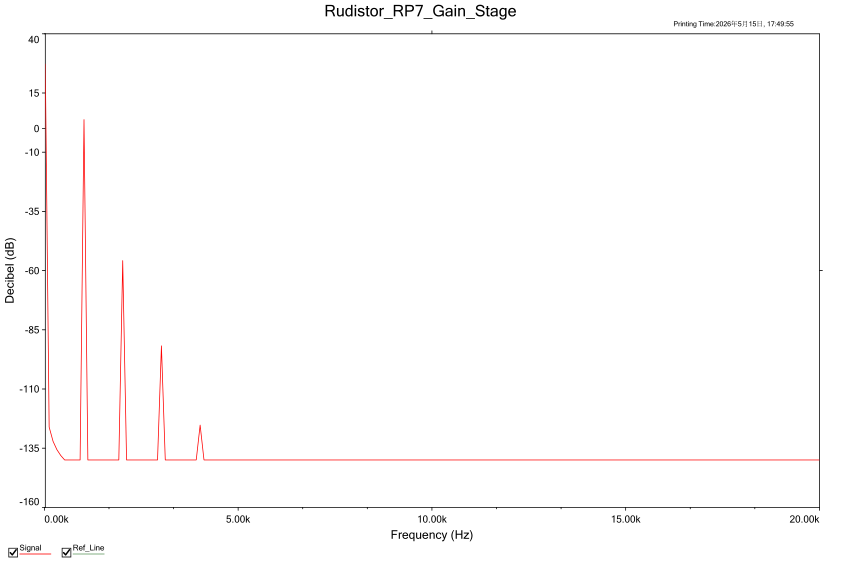

# Chapter 4

Hybrid amplifiers can be classified by device arrangement across stages, such as tube-gain/solid-state-power and solid-state-gain/tube-power designs. In practice, they usually sound either tube-like or solid-state-like, rather than a blend of both.

## Rudistor RP7
The Rudistor RP7 is a boutique hybrid headphone amplifier by Italian designer Rudi Stor. Community discussions often describe the RP7 having a warm-leaning presentation and strong pairing with classic high-impedance headphones such as the HD600, HD650, K501, and K601. Some users have complained about build quality and high pricing. Sadly, after the COVID-19 pandemic around 2020, Mr. Rudi lost contact with the Hi-Fi community.

The schematic, like the SinglePower amplifiers introduced in the previous chapter, is a textbook-simple circuit, single-end gain-stage and single-end output-stage, but there are also tricks in it. You may notice that R7 is an adjsustable resistor, what is it adjusted for?

First, it uses load-line distortion cancellation as I mentioned before, Nelson Pass wrote a brilliant article about it {{#cite pass2009thesweetspot}}, in short, the bending of the transfer and plate characteristics tends to cancel out.

Then, it implemented a Gain-stage Output-stage distortion cancellation technique. Note the in transfer characteristic above, the line is not straight, which means the transconductance(gm) of the tube is not constant, it becomes higher when input signal is positive, and lower when input negative. The nonlinearity makes one half of the waveform sharper and the other half blunter — one side peaks higher and narrower, the other peaks lower and wider:

The BJT in the output stage has a similarly nonlinear transfer curve. Although the physics differs — exponential rather than 3/2-power — the BJT also produces an asymmetric output waveform, but with the asymmetry reversed: one half-cycle is stretched where the tube compressed it, and compressed where the tube stretched it. If carefully tuned at a certain load, the distorted waveforms can cancel each other.

In the frequency domain, the asymmetry is easier to see and calculate: it is equivalent to a fundamental sine wave plus a second harmonic.

Here is Fourier analysis for the tube single-end gain stage, and BJT single-end output stage with 32-ohm loads.

| stage | gain-stage | output-stage |
|----------|----------|----------|
| THD  | 0.10%  | 0.08%  |
| 2nd-harmonic  | 0.01%  | 0.08%  |
| 2nd-phase  | 90  | -90  |
| 3rd-harmonic  | 0.001%  | 0.01%  |
| 3rd-phase  | 0  | 0  |

Second-harmonic distortion dominates both stages. Because the gain and output stages have opposite second-harmonic phase, they can cancel each other when tuned to the same magnitude at a specific load. In this design, cancellation is optimized near 32 ohms, a relatively heavy load given the 120-ohm emitter resistor. At higher headphone impedances (for example, 120 or 300 ohms), the output stage introduces less distortion, so cancellation becomes weaker.

Benefiting from this two distortion cancellation techniques, its measured performance is decent, at around 0.01% distortion as the manufacturer claims, yet it sounds absolutely lovely. It is one of my personal favourites. 

Nelson Pass famously said, "Simple Sounds Better" {{#cite norton1991simplesoundsbetter}}. The Rudistor RP7 is one of the clearest examples of why this idea works in practice: a simple topology with few stages, carefully tuned device behavior, and a benign distortion spectrum can produce both convincing measurements and highly natural sound.

### Why "simple sounds better"

In Pass’s interview with Stereophile {{#cite norton1991simplesoundsbetter}}, Pass claims simple circuits sound better because the signal passes through fewer devices, feedback loops, and correction mechanisms, so the amplifier adds fewer complex artifacts. He argues that simple topologies are easier to make stable and usually show better agreement between bench measurements and what we actually hear. He also prefers distortion spectra dominated by low-order, especially even-order harmonics, which tend to sound less objectionable than higher-order odd components often produced by more complex designs. So “simple sounds better” means not “primitive,” but “topologically clean, stable, and harmonically benign.” I will use the RP7 to show how and why that happens, from both theoretical and experimental perspectives. 

Here is the RP7's simple single-end triode gain stage. Its spectrum is dominated by second-order harmonic distortion, with higher-order harmonics almost absent.

