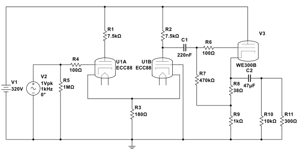
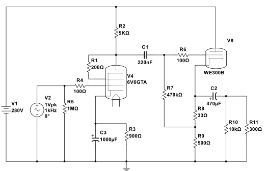
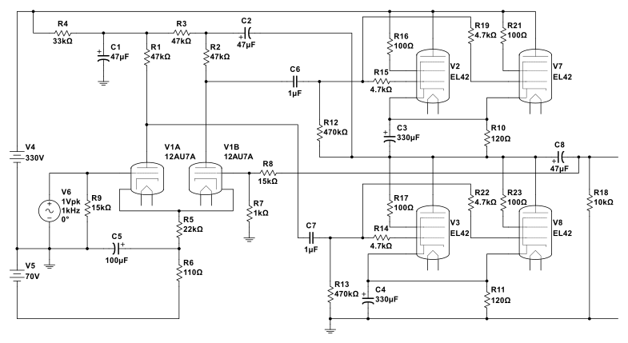
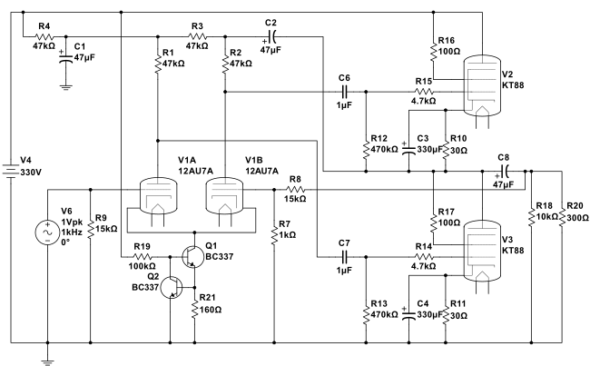

# Chapter 3

Tube is a fascinating device. Honestly, I am a super fan of tubes, even though I know they are not ideal devices for building amplifiers. Power tubes such as the KT88 or 6AS7 can typically deliver only about 100 mA, which is usually enough for headphones but far from enough for speakers. A KT88 also needs at least around 100 V for normal operation, which is power-inefficient compared with power BJTs that saturate at only a few volts.

It's commonly believed that tube amplifiers have high distortion and a high noise floor. Although they sound warm and pleasant, they are not considered high fidelity.

However, tube amplifiers can have low distortion. I will introduce three OTL tube amplifier designs that are classic gems in amplifier history. I've improved their performance using modern off-the-shelf components and simulations, making them high-performance amplifiers.

## Brocksieper Audio Earmax Pro
Earmax Pro is a beautifully compact headphone amplifier with elegant industrial design and meticulous casework.

It uses a simple voltage-gain stage, followed by an SRPP output stage that also provides gain. Because the amplifier has relatively low open-loop gain, the stability margin is generous. In addition, C2 introduces a zero at around 1.3 MHz, and simulation shows a phase margin above 120 degrees. This is substantially higher than many solid-state amplifiers. Could this be one reason some listeners perceive tube amplifiers as sounding better?

R5 introduces a DC offset at the headphone output. The offset is not large enough to damage headphones, but it does shift the voice coil away from its midpoint position. This is unusual, and it may have been used as a sound tuning technique.

The official website claims it can drive 32-ohm to 600-ohm loads, with output power up to 10 mW and distortion at 0.1%. In my simulation, I cannot reach those figures unless the main supply is raised from 90 V to 200 V. Measurements from L7audiolab show the same trend: at a 4 V RMS output level, its FFT spectrum looks messy, the distortion is high, and the amplifier is obviously overdriven.

Here I introduce a higher-power version, the Earmax Pro Max:

It uses a KT88 in triode configuration, replacing the small-signal ECC88 used in the original design, and raises quiescent current from about 10 mA to 100 mA. This makes the output stage strong enough to drive headphones down to 32 ohms, and distortion drops from 0.1% to 0.01% when driving 300-ohm loads at the same output level.

While maintaining the sonic character of the original Earmax, the substantially higher output power ensures the amplifier operates within its design specifications during rigorous modern measurement benchmarks. This prevents the excessive distortion that would otherwise result in unfavorable ratings.

All tube amplifiers introduced in this chapter have weak PSRR, so they must work with a low-ripple power supply. I will introduce the Maida power supply at the end of this chapter. As far as I know, it is one of the best power-supply options for tube amplifiers.

## Single Power MPX3
Single Power Audio Inc., founded by Mikhail Rotenberg in Colorado, USA, has been criticized for build-quality and safety concerns, including user-reported incidents in the audiophile community. The company was also notorious for frequent delivery delays. Its business was active around the 2010s, and then Mikhail suddenly lost contact with the audiophile community.

Despite these issues, their amplifiers sounded fabulous, and there is an ingenious trick in the circuit design. That why I must introduce their circuit design in thisbook.

The SinglePower MPX-3 was the mid-range model in its product line, selling for about $1000 at the time. It is a differential-input, cathode-follower-output amplifier with no global feedback. This kind of simple textbook circuits that needs little explanation.

The trick lies in R7, R8, and R9. This cathode-follower arrangement halves distortion from 1% to 0.5% and adds 50% more output power. To be honest, I still do not fully understand the underlying mechanism; it just works. Hopefully, I can explain it in a later version of this book.

Here I present a fine-tuned SinglePower-style headphone amplifier that combines a load-line distortion-cancellation method I learned from Nelson Pass {{#cite pass2009thesweetspot}} with gradient-descent optimization, reducing distortion from 0.5% to 0.007%, which is astonishing for an amplifier without global feedback.

## Yeli VAW-8PR Headphone Amplifiers
Yeli (叶立) 8PR is another headphone amplifier designed by Mr. Ye in Beijing, China, specifically for driving the Sennheiser HD600. Around the 2010s, it was regarded in the Chinese audiophile community as one of the best amplifiers for the HD600, and I believe it deserves wider worldwide recognition.

It features a differential input stage driving a SEPP output stage. The input and output stages inherently generate strong second-harmonic distortion, less third-harmonic distortion, and almost no high-order distortion.

Second-harmonic distortion is canceled in the input stage by the differential topology and in the output stage by the SEPP topology. R5, R6, and the -70 V supply provide high AC resistance while supplying enough DC current, further improving second-harmonic cancellation in the differential input pair.

In this design, the main purpose of the feedback loop is not to reduce distortion, because the intrinsic distortion is already low. Even so, the loop still provides additional distortion reduction. Its primary role is to stabilize output voltage, because a tube SEPP stage behaves more like a current-output stage and its output voltage varies significantly with load. Since headphone impedance can range from 32 ohms to 300 ohms, the output-voltage variation would otherwise be too large, which is unacceptable in a commercial amplifier product.

Thus, in this meticulous configuration, distortions are either canceled or not generated in the first place, resulting in a distortion level down to 0.001%, which is excellent for an amplifier that does not rely on deep negative feedback.

Here I propose a modern modification of the Yeli 8PR that removes the need for a -70 V power supply by using a BJT constant-current source as its differential tail.

## Maida Power Supply
All three tube OTL headphone amplifiers suffer from low PSRR (power-supply rejection ratio), so they need a precision power supply with extremely low ripple.

The Maida power supply {{#cite maida1980highvoltageadjustablepowersupplies}} suits this need. Tom Christiansen also suggests a modern design that uses up-to-date components and delivers better performance.

[Michael Maida's original regulator](https://www.ti.com/lit/an/snva583/snva583.pdf) uses a floating three-terminal regulator behind a high-voltage pass device. The regulator IC sees only a small input-to-output voltage, while the pass device withstands most of the B+ voltage. This makes it possible to regulate supplies of several hundred volts without applying the full voltage across the low-voltage regulator IC.

[Tom Christiansen's 21st Century Maida](https://www.diyaudio.com/community/threads/21st-century-maida-regulator.209067/) retains this principle but replaces the LM317 with an LT3080 and uses a high-voltage MOSFET cascode. The LT3080 requires less minimum-load current and has lower dropout, reducing dissipation in the feedback network. Soft start and protection diodes improve behavior during startup, shutdown, and load transients; Christiansen reported about 20 uV RMS of output ripple and noise with 50 V peak-to-peak ripple at the input.
